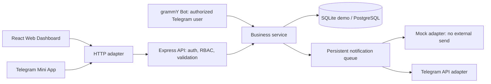
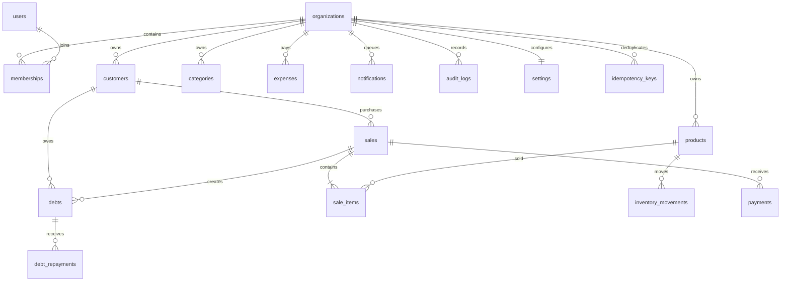

# Arxitektura

Barcha tashkilot yozuvlari `organizationId` bilan scope qilinadi. Sessiya user va organization ID olib yuradi, membership har so‘rovda qayta tekshiriladi. Bot `ctx.from.id` ni serverdagi `users.telegramId` ga bog‘laydi; noma’lum foydalanuvchi biznes ma’lumotiga kira olmaydi.

## Entity’lar

To‘liq bajariladigan schema: `server/db.ts`. Categories nomlari organization ichida unique; products kategoriyaning labelini saqlaydi. Money: BIGINT tiyin, qoldiq: integer dona. Sana UTC ISO string; biznes kuni Asia/Tashkent vaqtida hisoblanadi. Bir organization uchun barcha mutatsiyalar serializatsiya qilinadi. Dastlabki kichik biznes oqimi uchun oddiy va ishonchli; yuqori throughputda granular stock/debt locking va server pagination qo‘shish kerak.

## Savdo tranzaksiyasi

1. JWT/Telegram user → organization membership → rol tekshiruvi.
2. Tashkilot row lock, kalit/payload xeshi tekshiruvi.
3. Mijoz va mahsulotlar aynan shu organization’ga tegishli ekanini tekshirish.
4. Bir xil mahsulot satrlarini birlashtirish, qoldiq, narx, chegirma va aralash to‘lovni hisoblash.
5. Sale + sale items + payments, inventory movements va mahsulot qoldig‘ini yozish.
6. To‘lanmagan qism uchun debt yaratish.
7. Notification, audit va idempotency javobini saqlash; commit.
8. UI snapshot qayta yuklanadi. Moliyaviy summa muvaffaqiyatli commit bo‘lmasdan UI’da bajarilgandek ko‘rsatilmaydi.

To‘lov: debt amount − payment-kind debt repayments. Reversed debt qoldig‘i 0. Overpayment rad etiladi. Status: paid → overdue → partial → active ustuvorligida aniqlanadi.

## Qaytarish

Savdo yozuvi o‘chirilmaydi: status reversed, reversedAt yoziladi. Stock qaytaruvchi inventory movements, boshlang‘ich sale payment’lar uchun refund va debt repayment’lar uchun refund yozuvlari qo‘shiladi. Debt reversedAt bilan yopiladi. Hisobot faqat completed savdolarni foydaga kiritadi. Refund bank o‘tkazmasi emas; jismoniy/elektron qaytarish alohida bajariladi.

## Xavfsizlik chegaralari

Demo auth faqat DEMO_MODE=true instansiyada. Production JWT_SECRET majburiy, session cookie Secure faqat HTTPS APP_URL bilan. Origin allowlist APP_URL/WEB_APP_URL’dan olinadi; alohida origin’da frontend deploy qilinganda reverse proxy yoki CORS/cookie siyosatini moslash kerak. Joriy joylashuv same-origin uchun.

Telegram initData hash serverda HMAC-SHA256 bilan tekshiriladi. Auth date 300 soniyadan eski bo‘lsa rad etiladi. Mini App sessiyasida JWT faqat adapter xotirasida turadi va Authorization: Bearer orqali yuboriladi, chunki Telegram Web iframe’da third-party cookie bloklanishi mumkin. Qayta yuklashda initData yana tekshiriladi; muddati tugasa Mini Appni qayta ochish kerak. Frame ancestors faqat self/Telegram domenlariga ruxsat beradi. Webhook grammy secret-token tekshiruvi bilan ishlaydi. Server kalitlari web bundle’ga kiritilmaydi.

Audit biznes endpointlari orqali append-only. Baza administratorining to‘g‘ridan-to‘g‘ri SQL huquqlari bundan tashqarida; production DB role grants va tashqi immutable audit saqlashni ekspluatatsiya siyosati belgilashi kerak.
